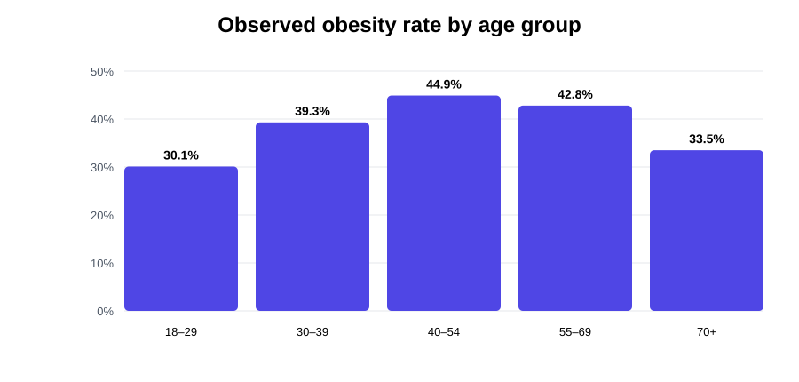
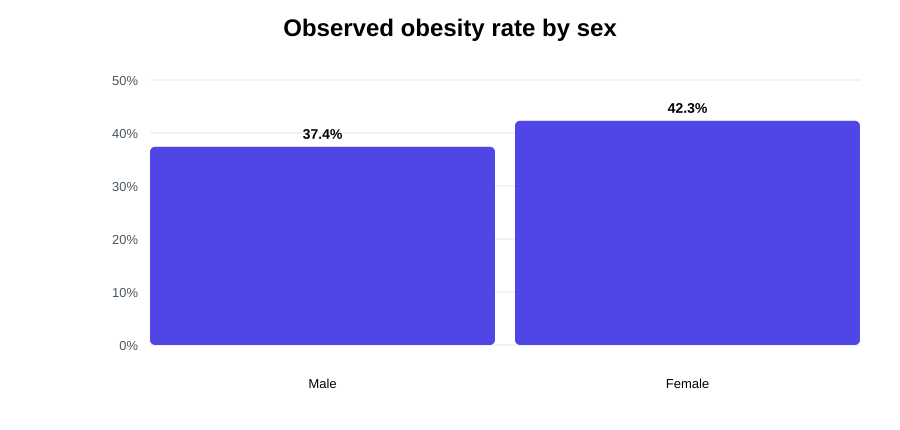
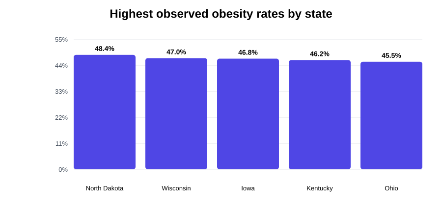
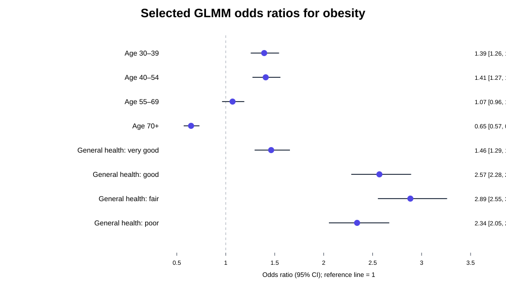

# Factors Influencing Adult Obesity in the United States

An applied health-data science analysis of adult obesity using the **2022 Behavioral Risk Factor Surveillance System (BRFSS)**. The project examines demographic, socioeconomic, behavioral, and health correlates of obesity and compares several regression frameworks for binary and ordered BMI outcomes.

> **Project context:** This repository is a cleaned, reproducible portfolio version of a 2023/24 Health Data Science course group project (EM1413). The original project was completed by **Maha Gasim, Amal Ahmed, and Arnela Halili**. Repository curation and reproducibility refactoring were completed by Maha Gasim.

## Results at a glance

The final modelling sample contained **39,551 observations across 54 state/territory groups**. The descriptive results show meaningful variation in observed obesity prevalence across age, sex, and geography.

### Descriptive analysis



Observed obesity was lowest among adults aged **18–29 (30.1%)**, rose through middle age, peaked among those aged **40–54 (44.9%)**, and declined among adults aged **70+ (33.5%)** in the filtered analytical sample.



Women had a higher observed obesity rate (**42.3%**) than men (**37.4%**) in the filtered sample.



The five highest observed state-level obesity rates in the analytical sample were **North Dakota (48.4%)**, **Wisconsin (47.0%)**, **Iowa (46.8%)**, **Kentucky (46.2%)**, and **Ohio (45.5%)**.

### Model analysis

The final generalized linear mixed model estimated obesity using demographic, socioeconomic, behavioral, and health covariates, with a **state-level random intercept**.



Selected reported GLMM estimates:

| Predictor | Odds ratio | 95% CI | Interpretation |
|---|---:|---:|---|
| Age 30–39 vs 18–29 | 1.39 | 1.26–1.54 | Higher odds of obesity |
| Age 40–54 vs 18–29 | 1.41 | 1.27–1.56 | Higher odds of obesity |
| Age 55–69 vs 18–29 | 1.07 | 0.96–1.19 | CI crosses 1 |
| Age 70+ vs 18–29 | 0.65 | 0.57–0.73 | Lower odds of obesity |
| General health: very good vs excellent | 1.46 | 1.29–1.66 | Higher odds of obesity |
| General health: good vs excellent | 2.57 | 2.28–2.89 | Higher odds of obesity |
| General health: fair vs excellent | 2.89 | 2.55–3.26 | Higher odds of obesity |
| General health: poor vs excellent | 2.34 | 2.05–2.67 | Higher odds of obesity |

The reported state random-intercept variance was **0.0157** (SD **0.1255**) with an ICC of approximately **0.0155**, indicating modest between-state variation after accounting for the included individual-level covariates.

➡️ **[See the fuller results summary and model interpretation](results/README.md)**

## Research question

Which demographic, socioeconomic, behavioral, and health characteristics are associated with adult obesity in the United States, and how much does baseline obesity risk vary across states?

## Data

The original analysis used the **2022 BRFSS**. A Stata preprocessing step retained 15 variables from the working BRFSS file before the analysis continued in R.

The course report started from **445,132 observations** in the reduced BRFSS extract. After complete-case filtering and removal of survey-specific nonresponse codes used in the original workflow, the modelling dataset contained **39,551 observations**.

Raw and processed BRFSS data are intentionally not stored in this repository. See [`data/README.md`](data/README.md) for expected inputs and provenance.

## Methods

The repository reproduces the analytical scope of the submitted course project:

1. **Data preparation** — variable selection in Stata; complete-case filtering; removal of selected nonresponse/refusal codes; recoding of age, education, income, sex, marital status, employment status, diabetes, heart disease, and state; binary obesity indicator based on the BRFSS BMI category.
2. **Exploratory analysis** — demographic and health distributions; state-level obesity rates; contingency, joint-probability, and conditional-probability tables.
3. **Binary logistic regression** — age-only model; multivariable obesity model; sex and income model.
4. **Multinomial logistic regression** — four-category BMI outcome.
5. **Ordinal logistic regression** — nested model comparison using AIC and BIC.
6. **Generalized linear mixed model (GLMM)** — logistic mixed model with a state-level random intercept.

## Repository structure

```text
adult-obesity-brfss-analysis/
├── README.md
├── AUTHORS.md
├── .gitignore
├── run_analysis.R
├── stata/
│   └── 01_extract_brfss.do
├── R/
│   ├── 00_packages.R
│   ├── 01_prepare_data.R
│   ├── 02_descriptive_analysis.R
│   └── 03_models.R
├── analysis/
│   └── obesity_analysis.Rmd
├── data/
│   └── README.md
├── docs/
│   ├── methodology.md
│   ├── refactor_notes.md
│   └── source_inventory.md
└── results/
    ├── README.md
    └── figures/
        ├── obesity_by_age.svg
        ├── obesity_by_sex.svg
        ├── top_states_obesity.svg
        └── glmm_selected_odds_ratios.svg
```

## Reproducing the analysis

### Option A — use the prepared analysis dataset

Place the full `filtered_data.csv` produced by the original workflow at:

```text
data/processed/filtered_data.csv
```

Then run:

```r
source("run_analysis.R")
```

### Option B — rebuild from the reduced BRFSS extract

Place `Demo+Health data.dta` or `Demo+Health data.xlsx` in `data/raw/`. The Stata extraction script documents how the reduced file was created from the BRFSS working data, and the R preparation script applies the recoding/filtering used in the final report.

## Methodological note

This repository preserves the modelling scope of the submitted project. The original code did **not** implement BRFSS survey-weighted estimation. The refactor therefore does not present the models as population-representative survey estimates; it focuses on transparent reproduction of the original applied modelling workflow. Reported descriptive percentages and model coefficients above are therefore results from the project's filtered analytical sample, not survey-weighted U.S. population estimates.

## Skills demonstrated

- R / RMarkdown
- Stata
- health survey data preparation
- data cleaning and recoding
- exploratory data analysis and visualization
- binary logistic regression
- multinomial logistic regression
- ordinal logistic regression
- mixed-effects logistic regression (`glmmTMB`)
- model comparison with AIC/BIC
- reproducible project organization

## Attribution

See [`AUTHORS.md`](AUTHORS.md). The repository deliberately preserves the group-project attribution rather than presenting the original coursework as sole-authored work.
